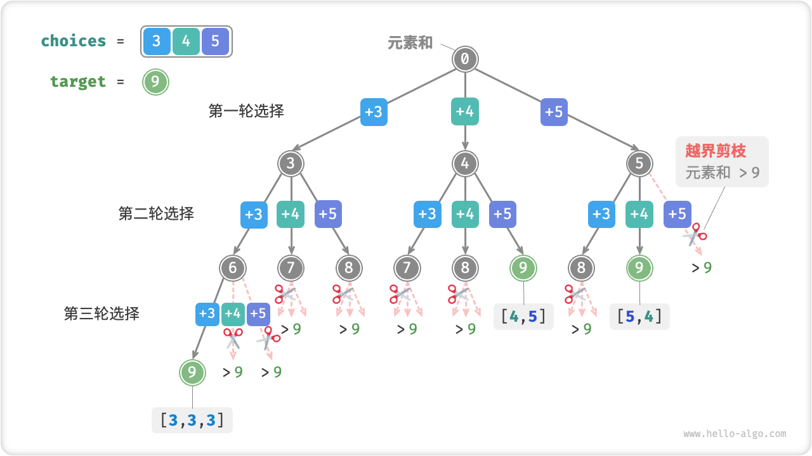
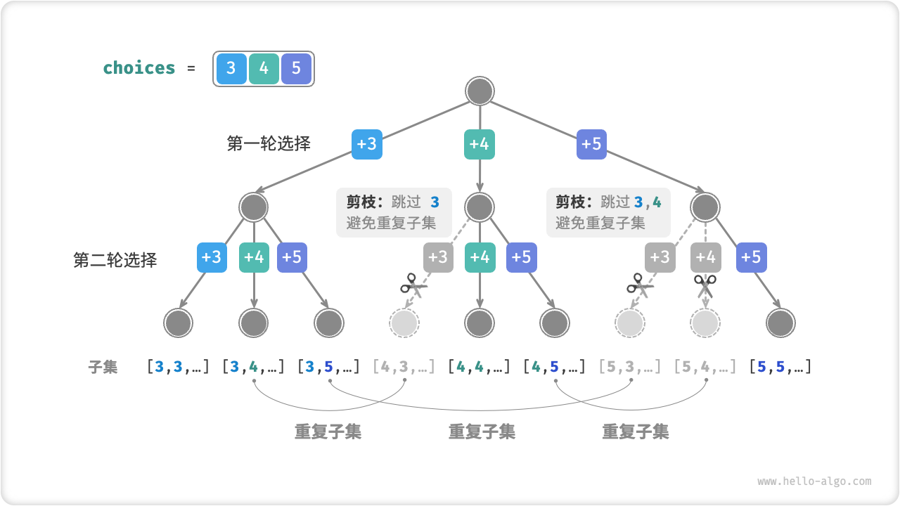
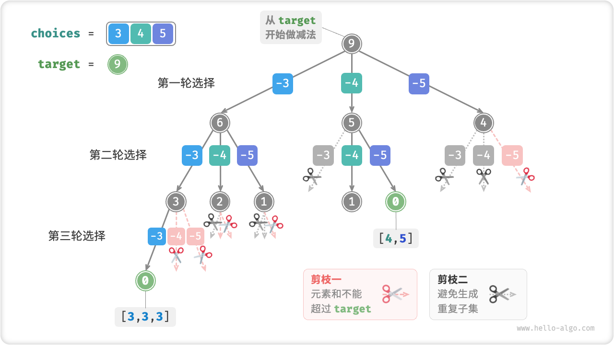

# [39.组合总和](https://leetcode.cn/problems/combination-sum/description/)

给你一个 **无重复元素** 的整数数组 `candidates` 和一个目标整数 `target` ，找出 `candidates` 中可以使数字和为目标数 `target` 的 所有 不同组合 ，并以列表形式返回。你可以按 **任意顺序** 返回这些组合。

`candidates` 中的 **同一个** 数字可以 **无限制重复被选取** 。如果至少一个数字的被选数量不同，则两种组合是不同的。 

对于给定的输入，保证和为 `target` 的不同组合数少于 150 个。


示例 1：
```
输入：candidates = [2,3,6,7], target = 7
输出：[[2,2,3],[7]]
解释：
2 和 3 可以形成一组候选，2 + 2 + 3 = 7 。注意 2 可以使用多次。
7 也是一个候选， 7 = 7 。
仅有这两种组合。
```

示例 2：
```
输入: candidates = [2,3,5], target = 8
输出: [[2,2,2,2],[2,3,3],[3,5]]
```

示例 3：
```
输入: candidates = [2], target = 1
输出: []
```

提示：

- 1 <= candidates.length <= 30
- 2 <= candidates[i] <= 40
- candidates 的所有元素 互不相同
- 1 <= target <= 40

## 思路：

例如，输入集合 {3, 4, 5} 和目标整数 9 ，解为 {3, 3, 3}, {4, 5} 。需要注意两点：

- 输入集合中的元素可以被无限次重复选取。
- 子集是不区分元素顺序的，比如 {4,5} 和 {5,4} 是同一个子集。

搜索过程是区分选择顺序的，然而子集不区分选择顺序。如下图所示，先选 4 后选 5 与先选 5 后选 4 是两个不同的分支，但两者对应同一个子集。



为了去除重复子集，一种直接的思路是对结果列表进行去重。但这个方法效率很低，因为：

- 当数组元素较多，尤其是当 target 较大时，搜索过程会产生大量的重复子集。
- 比较子集（数组）的异同非常耗时，需要先排序数组，再比较数组中每个元素的异同。

### 重复子集剪枝

**在搜索过程中通过剪枝进行去重**。观察下图，重复子集是在以不同顺序选择数组元素时产生的，具体来看：

1. 第一轮和第二轮分别选择 3, 4 ，会生成包含这两个元素的所有子集，记为 [3, 4, ⋯] 。
2. 若第一轮选择 4 ，则第二轮应该跳过 3 ，因为该选择产生的子集 [4, 3, ⋯] 和 1. 中生成的子集完全重复。

分支越靠右，需要排除的分支也越多，例如：

1. 前两轮选择 3, 5 ，生成子集 [3, 5, ⋯] 。
2. 前两轮选择 4, 5 ，生成子集 [4, 5, ⋯] 。
3. 若第一轮选择 5 ，则第二轮应该跳过 3 和 4 ，因为子集 [5, 3, ⋯] 和子集 [5, 4, ⋯] 和 1. , 2. 中生成的子集完全重复。



总结来看，给定输入数组 \([x_1, x_2, \cdots, x_n]\)，设搜索过程中的选择序列为 \([x_{i_1}, x_{i_2}, \cdots, x_{i_m}]\)，则该选择序列需要满足 \(i_1 \leq i_2 \leq \cdots \leq i_m\)，**不满足该条件的选择序列都会造成重复，应当剪枝**。

## 代码

为实现该剪枝，我们初始化变量 `start`，用于指示遍历起点。当做出选择 \( x_i \) 后，设定下一轮从索引 `i` 开始遍历。这样做就可以让选择序列满足 \( i_1 \leq i_2 \leq \cdots \leq i_m \)，从而保证子集唯一。

除此之外，我们还对代码进行了两项优化：

1. **排序与提前终止**：  
   在开启搜索前，先将数组 `nums` 排序。在遍历所有选择时，若子集和超过 `target`，则直接结束循环，因为后续元素更大，其子集和一定会超过 `target`。

2. **减法代替累加**：  
   省去元素和变量 `total`，通过在 `target` 上执行减法来统计元素和。当 `target` 减至 `0` 时，记录当前解。

```python
class Solution:
    def backtrack(self, state: list[int], target: int, choices: list[int], start: int, res: list[list[int]]):
        # 子集和等于 target 时，记录解
        if target == 0:
            res.append(list(state))
            return
        # 遍历所有选择
        # 剪枝二：从 start 开始遍历，避免生成重复子集
        for i in range(start, len(choices)):
            # 剪枝一：若子集和超过 target ，则直接结束循环
            # 这是因为数组已排序，后边元素更大，子集和一定超过 target
            if target - choices[i] < 0:
                break
            # 尝试：做出选择，更新 target, start
            state.append(choices[i])
            # 进行下一轮选择
            self.backtrack(state, target - choices[i], choices, i, res)
            # 回退：撤销选择，恢复到之前的状态
            state.pop()

    def combinationSum(self, candidates: List[int], target: int) -> List[List[int]]:
        state = []  # 状态（子集）
        candidates.sort()  # 对 candidates 进行排序
        start = 0  # 遍历起始点
        res = []  # 结果列表（子集列表）
        self.backtrack(state, target, candidates, start, res)
        return res
```

如下图所示，为将数组 [3,4,5] 和目标元素 9 输入到以上代码后的整体回溯过程。



!!! tip
    **在求和问题中，排序之后加剪枝是常见的套路！**

