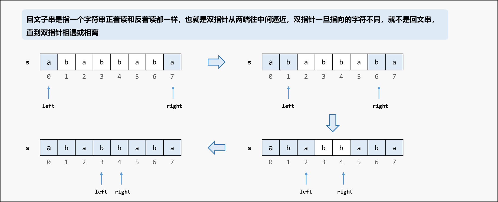

# [131.分割回文串](https://leetcode.cn/problems/palindrome-partitioning/description/)

给你一个字符串 `s`，请你将 `s` 分割成一些 **子串**，使每个子串都是 **回文串** 。返回 `s` 所有可能的分割方案。

示例 1：
```
输入：s = "aab"
输出：[["a","a","b"],["aa","b"]]
```

示例 2：
```
输入：s = "a"
输出：[["a"]]
```

提示：

- 1 <= s.length <= 16
- s 仅由小写英文字母组成

## 思路


每次是在对字符串的某一个后缀进行处理：我们处理每一次分割位置，都是枚举当前起点位置start之后的位置j，**判断子串s[start, j]是否为一个回文串**：

- 如果是，就继续处理剩下的s[j+1, n)的部分，直到处理完整个字符串；
- 如果不是，说明当前的子串不可用，继续枚举下一个位置 j；

## 回溯法


回溯最重要的就是 **还原现场**：递归前加入的元素，递归后要淘汰

## 判断回文子串的两种方法

### 双指针判断



### 动态规划预处理


由于 `i` 需要 `i+1` 的状态，因此 `i` 逆序遍历；`j` 需要 `j-1` 的状态，因此 `j` 正序遍历；

我们可以在回溯之前先进行二重循环生成所有的状态 `isPalindrome[i][j]`，这样对于任意的子串 `s[start, j]` 都可以直接通过状态数组 `isPalindrome[start][j]` 进行判断；

而不用每次回溯的时候都执行一次双指针，比如判断了 `[start, j]` 的时候遍历了一遍 `[start, j]`的字符，判断 `[start, j+1]` 的收又遍历一遍 `[start, j+1]`的字符，`[start, j]`部分就被重复遍历了。