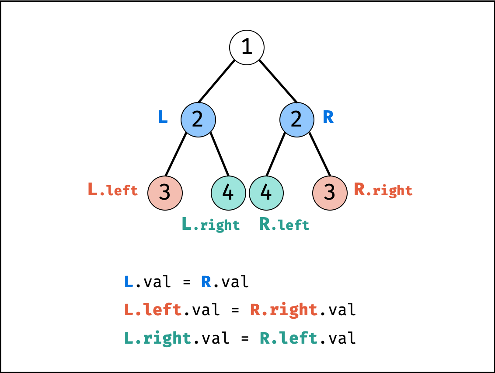

# [101.对称二叉树](https://leetcode.cn/problems/symmetric-tree/description/)

给你一个二叉树的根节点 root ， 检查它是否轴对称。

示例 1：

```
输入：root = [1,2,2,3,4,4,3]
输出：true
```

示例 2：

```
输入：root = [1,2,2,null,3,null,3]
输出：false
```

提示：
- 树中节点数目在范围 [1, 1000] 内
- -100 <= Node.val <= 100
 
进阶：你可以运用递归和迭代两种方法解决这个问题吗？

## 思路

**对称二叉树定义**： 对于树中 **任意两个对称节点** L 和 R ，一定有：

- L.val = R.val ：即此两对称节点值相等。
- L.left.val = R.right.val ：即 L 的 左子节点 和 R 的 右子节点 对称。
- L.right.val = R.left.val ：即 L 的 右子节点 和 R 的 左子节点 对称。

根据以上规律，考虑从顶至底递归，判断每对左右节点是否对称，从而判断树是否为对称二叉树。



## 算法步骤

### 递归法

#### 1. 确定递归函数的参数和返回值

因为我们要比较的是根节点的两个子树是否是相互翻转的，进而判断这个树是不是对称树，所以要比较的是两个树，参数自然也是左子树节点和右子树节点。

返回值自然是bool类型。

#### 2. 确定终止条件

要比较两个节点数值相不相同，首先要把两个节点为空的情况弄清楚！否则后面比较数值的时候就会操作空指针了。

节点为空的情况有：（注意我们比较的其实不是左孩子和右孩子，所以如下我称之为左节点右节点）

- 左节点为空，右节点不为空，不对称，return false
- 左不为空，右为空，不对称 return false
- 左右都为空，对称，返回true

此时已经排除掉了节点为空的情况，那么剩下的就是左右节点不为空：

- 左右都不为空，比较节点数值，不相同就return false

此时左右节点不为空，且数值也不相同的情况我们也处理了。

#### 3. 确定单层递归的逻辑

此时才进入单层递归的逻辑，单层递归的逻辑就是处理 左右节点都不为空，且数值相同的情况。

- 比较二叉树外侧是否对称：传入的是左节点的左孩子，右节点的右孩子。
- 比较内侧是否对称，传入左节点的右孩子，右节点的左孩子。
- 如果左右都对称就返回true ，有一侧不对称就返回false 。

```python
def isSymmetric(self, root: TreeNode) -> bool:
    if not root:
        return True
    return self.compare(root.left, root.right)
    
def compare(self, left, right):
    # 首先排除空节点的情况
    if left == None and right != None: return False
    elif left != None and right == None: return False
    elif left == None and right == None: return True
    # 排除了空节点，再排除数值不相同的情况
    elif left.val != right.val: return False
    
    # 此时就是：左右节点都不为空，且数值相同的情况
    # 此时才做递归，做下一层的判断
    outside = self.compare(left.left, right.right) # 左子树：左、 右子树：右
    inside = self.compare(left.right, right.left) # 左子树：右、 右子树：左
    isSame = outside and inside # 左子树：中、 右子树：中 （逻辑处理）
    return isSame
```

```python
def isSymmetric(self, root: Optional[TreeNode]) -> bool:
    def dfs(left, right):
        if not left and not right: return True
        if not left or not right or left.val != right.val: return False
        return dfs(left.left, right.right) and recur(left.right, right.left)
    return not root or dfs(root.left, root.right)
```


### 迭代法

#### 队列
通过队列来判断根节点的左子树和右子树的内侧和外侧是否相等

```python
import collections

def isSymmetric(self, root: TreeNode) -> bool:
    if not root:
        return True
    queue = collections.deque()
    queue.append(root.left) # 将左子树头结点加入队列
    queue.append(root.right) # 将右子树头结点加入队列
    while queue: # 接下来就要判断这这两个树是否相互翻转
        leftNode = queue.popleft()
        rightNode = queue.popleft()
        if not leftNode and not rightNode: # 左节点为空、右节点为空，此时说明是对称的
            continue
        
        # 左右一个节点不为空，或者都不为空但数值不相同，返回false
        if not leftNode or not rightNode or leftNode.val != rightNode.val:
            return False
        queue.append(leftNode.left) # 加入左节点左孩子
        queue.append(rightNode.right) # 加入右节点右孩子
        queue.append(leftNode.right) # 加入左节点右孩子
        queue.append(rightNode.left) # 加入右节点左孩子
    return True
```

#### 栈

这个迭代法，其实是把左右两个子树要比较的元素顺序放进一个容器，然后成对成对的取出来进行比较，那么其实使用栈也是可以的

```python
def isSymmetric(self, root: TreeNode) -> bool:
    if not root:
        return True
    st = [] # 这里改成了栈
    st.append(root.left)
    st.append(root.right)
    while st:
        rightNode = st.pop()
        leftNode = st.pop()
        if not leftNode and not rightNode:
            continue
        if not leftNode or not rightNode or leftNode.val != rightNode.val:
            return False
        st.append(leftNode.left)
        st.append(rightNode.right)
        st.append(leftNode.right)
        st.append(rightNode.left)
    return True
```

## 相关题目推荐

这两道题目基本和本题是一样的

* [100.相同的树](https://leetcode.cn/problems/same-tree/)
* [572.另一个树的子树](https://leetcode.cn/problems/subtree-of-another-tree/)
