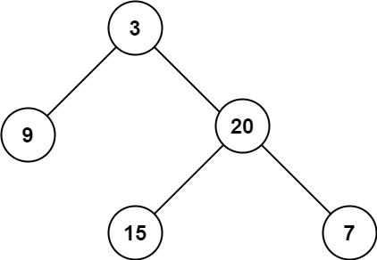

# [104.二叉树的最大深度](https://leetcode.cn/problems/maximum-depth-of-binary-tree/description/)

给定一个二叉树 `root` ，返回其最大深度。

二叉树的 **最大深度** 是指从根节点到最远叶子节点的最长路径上的节点数。

示例 1：

```
输入：root = [3,9,20,null,null,15,7]
输出：3
```

示例 2：
```
输入：root = [1,null,2]
输出：2
```

提示：

- 树中节点的数量在 [0, 10^4^] 区间内。
- -100 <= Node.val <= 100

## 思路：
树的遍历方式总体分为两类：深度优先搜索（DFS）、广度优先搜索（BFS）。

- 常见 DFS ： 先序遍历、中序遍历、后序遍历
- 常见 BFS ： 层序遍历（即按层遍历）

二叉树节点的深度和高度：

- **二叉树节点的深度**：指从根节点到该节点的最长简单路径边的条数或者节点数（取决于深度从0开始还是从1开始）

- **二叉树节点的高度**：指从该节点到叶子节点的最长简单路径边的条数或者节点数（取决于高度从0开始还是从1开始）

**根节点的高度就是二叉树的最大深度**

## 前序遍历

前序遍历才是真正求深度的逻辑

### 递归法

```python
class Solution:
    def __init__(self):
        self.result = 0

    def maxDepth(self, root: Optional[TreeNode]) -> int:
        self.result = 0
        if not root: 
            return self.result
        self.get_depth(root, 1)
        return self.result

    def get_depth(self, node: TreeNode, depth: int) -> None:
        self.result = max(self.result, depth)  # 中
        if not node.left and not node.right: 
            return
        if node.left:  
            self.get_depth(node.left, depth + 1)
        if node.right: 
            self.get_depth(node.right, depth + 1)
```

### 迭代法

使用栈模拟递归

```python
def maxDepth(self, root: Optional[TreeNode]) -> int:
    stack = []
    if root:
        stack.append((1, root))  # (当前深度, 节点)
    
    max_depth = 0
    while stack:
        depth, node = stack.pop()
        max_depth = max(max_depth, depth)
        if node.right:
            stack.append((depth + 1, node.right))
        if node.left:
            stack.append((depth + 1, node.left))
    
    return max_depth
```

## 后序遍历

后序遍历计算的是树的高度

关键点： 此树的深度和其左（右）子树的深度之间的关系。显然，**此树的深度** 等于 **左子树的深度** 与 **右子树的深度** 中的 **最大值** +1 。


##### 复杂度分析：
- 时间复杂度 O(N) ： N 为树的节点数量，计算树的深度需要遍历所有节点。
- 空间复杂度 O(N) ： 最差情况下（当树退化为链表时），递归深度可达到 N 。

### 递归法

```python
def maxDepth(self, root: Optional[TreeNode]) -> int:
    if not root: 
        return 0
    return max(self.maxDepth(root.left), self.maxDepth(root.right)) + 1
```

### 迭代法

```python
def maxDepth(self, root: Optional[TreeNode]) -> int:
    stack = []
    if root: 
        stack.append((1, root))
    
    depth = 0
    while stack:
        current_depth, node = stack.pop()
        if node:
            depth = max(depth, current_depth)
            stack.append((current_depth + 1, node.left))
            stack.append((current_depth + 1, node.right))
    
    return depth
```

## 层序遍历（BFS）

树的层序遍历 / 广度优先搜索往往利用 **队列** 实现。

使用迭代法的话，使用层序遍历是最为合适的，因为最大的深度就是二叉树的层数，和层序遍历的方式极其吻合

关键点： 每遍历一层，则计数器 +1 ，直到遍历完成，则可得到树的深度。

#### 算法解析：
1. **特例处理**： 当 root​ 为空，直接返回 深度 0 。
2. **初始化**： 队列 queue （加入根节点 root ），计数器 res = 0。
3. **循环遍历**： 当 queue 为空时跳出。
    a. 初始化一个空列表 tmp ，用于临时存储下一层节点。
    b. 遍历队列： 遍历 queue 中的各节点 node ，并将其左子节点和右子节点加入 tmp。
    c. 更新队列： 执行 queue = tmp ，将下一层节点赋值给 queue。
    d. 统计层数： 执行 res += 1 ，代表层数加 1。
4. **返回值**： 返回 res 即可。

```python
def maxDepth(self, root: Optional[TreeNode]) -> int:
    if not root:
        return 0
    
    depth = 0
    queue = collections.deque([root])
    
    while queue:
        depth += 1
        for _ in range(len(queue)):
            node = queue.popleft()
            if node.left:
                queue.append(node.left)
            if node.right:
                queue.append(node.right)
    
    return depth
```

##### 复杂度分析：
- 时间复杂度 O(N) ： N 为树的节点数量，计算树的深度需要遍历所有节点。
- 空间复杂度 O(N) ： 最差情况下（当树平衡时），队列 queue 同时存储 N/2 个节点。

## 相关题目推荐

- [559.n叉树的最大深度](https://leetcode.cn/problems/maximum-depth-of-n-ary-tree/)
