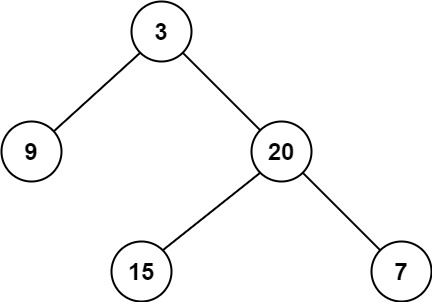

# [111.二叉树的最小深度](https://leetcode.cn/problems/minimum-depth-of-binary-tree/description/)

给定一个二叉树，找出其最小深度。

最小深度是从根节点到最近叶子节点的最短路径上的节点数量。

说明：叶子节点是指没有子节点的节点。

示例 1：

```
输入：root = [3,9,20,null,null,15,7]
输出：2
```

示例 2：
```
输入：root = [2,null,3,null,4,null,5,null,6]
输出：5
```

提示：
- 树中节点数的范围在 [0, 105] 内
- -1000 <= Node.val <= 1000

## 思路：

终止条件、返回值和递归过程:

- 当前节点 `root` 为空时，说明此处树的高度为 0，0 也是最小值
- 当前节点 `root` 的左子树和右子树都为空时，说明此处树的高度为 1，1 也是最小值
- 如果为其他情况，则说明当前节点有值，且需要分别计算其左右子树的最小深度，返回最小深度 +1，+1 表示当前节点存在有 1 个深度

## DFS
### 后序遍历
#### 递归法
```python
def minDepth(self, root: Optional[TreeNode]) -> int:
    if root is None:
        return 0
    if root.left is None and root.right is not None:
        return 1 + self.minDepth(root.right)
    if root.left is not None and root.right is None:
        return 1 + self.minDepth(root.left)
    return 1 + min(self.minDepth(root.left), self.minDepth(root.right))
```

#### 迭代法
```python
def minDepth(self, root: Optional[TreeNode]) -> int:
    if not root:
        return 0
    
    stack = []
    current = root
    last_visited = None
    min_depth = float('inf')
    depth = 1
    
    while stack or current:
        if current:
            stack.append((current, depth))
            current = current.left
            depth += 1
        else:
            node, depth = stack[-1]
            if not node.right or node.right == last_visited:
                if not node.left and not node.right:
                    min_depth = min(min_depth, depth)
                last_visited = stack.pop()[0]
            else:
                current = node.right
                depth += 1
    
    return min_depth
```

### 前序遍历
#### 递归法
```python
def __init__(self):
    self.result = float('inf')

def getDepth(self, node, depth):
    if node is None:
        return
    if node.left is None and node.right is None:
        self.result = min(self.result, depth)
    if node.left:
        self.getDepth(node.left, depth + 1)
    if node.right:
        self.getDepth(node.right, depth + 1)

def minDepth(self, root: Optional[TreeNode]) -> int:
    if root is None:
        return 0
    self.getDepth(root, 1)
    return self.result
```

#### 迭代法
```python
def minDepth(self, root: Optional[TreeNode]) -> int:
    if not root:
        return 0
    
    stack = [(root, 1)]
    min_depth = float('inf')
    
    while stack:
        node, depth = stack.pop()
        # Update min_depth only at leaf nodes
        if not node.left and not node.right:
            min_depth = min(min_depth, depth)
        # Right first so left gets processed first (LIFO)
        if node.right:
            stack.append((node.right, depth + 1))
        if node.left:
            stack.append((node.left, depth + 1))
    
    return min_depth
```

**优化：**

```python
def minDepth(self, root: Optional[TreeNode]) -> int:
    if not root:
        return 0
    
    stack = [(root, 1)]
    min_depth = float('inf')
    
    while stack:
        node, depth = stack.pop()
        # Early termination if we find depth 1 (best case)
        if depth == 1 and not node.left and not node.right:
            return 1
        if depth >= min_depth:
            continue  # Prune unnecessary searches
        if not node.left and not node.right:
            min_depth = depth
        if node.right:
            stack.append((node.right, depth + 1))
        if node.left:
            stack.append((node.left, depth + 1))
    
    return min_depth
```

## BFS
### 层序遍历

```python
def minDepth(self, root: Optional[TreeNode]) -> int:
    if not root:
        return 0
    que = collections.deque([(root, 1)])
    while que:
        node, depth = que.popleft()
        if not node.left and not node.right:
            return depth
        if node.left:
            que.append((node.left, depth + 1))
        if node.right:
            que.append((node.right, depth + 1))
    
    return 0
```