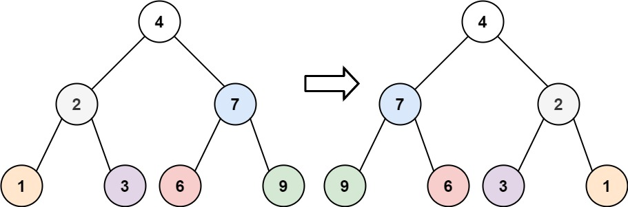

# [226.翻转二叉树](https://leetcode.cn/problems/invert-binary-tree/)

给你一棵二叉树的根节点 root ，翻转这棵二叉树，并返回其根节点。

示例 1：

```
输入：root = [4,2,7,1,3,6,9]
输出：[4,7,2,9,6,3,1]
```

示例 2：

```
输入：root = [2,1,3]
输出：[2,3,1]
```

示例 3：
```
输入：root = []
输出：[]
```

提示：
- 树中节点数目范围在 [0, 100] 内
- -100 <= Node.val <= 100

# 思路
**二叉树镜像定义**： 对于二叉树中任意节点 root ，设其左 / 右子节点分别为 left,right ；则在二叉树的镜像中的对应 root 节点，其左 / 右子节点分别为 right, left 。


可以发现想要翻转它，其实就把每一个节点的左右孩子交换一下就可以了。

遍历的过程中去翻转每一个节点的左右孩子就可以达到整体翻转的效果。

**这道题目使用前序遍历和后序遍历都可以，唯独中序遍历不方便，因为中序遍历会把某些节点的左右孩子翻转了两次！**

**层序遍历也是可以的！只要把每一个节点的左右孩子翻转一下的遍历方式都是可以的！**

## 递归法
### 前序遍历
```python
def invertTree(self, root: TreeNode) -> TreeNode:
    if not root:
        return None
    root.left, root.right = root.right, root.left
    self.invertTree(root.left)
    self.invertTree(root.right)
    return root
```
### 后序遍历
```python
def invertTree(self, root: TreeNode) -> TreeNode:
    if not root:
        return root
        
    left = self.invertTree(root.left)
    right = self.invertTree(root.right)
    root.left, root.right = right, left
    return root
```

## 迭代法
### 深度优先遍历

### 广度优先遍历
```python
def invertTree(self, root):
	if not root:
	    return None

	queue = [root]
	while queue:
		node = queue.pop(0)
		node.left, node.right = node.right,node.left
		if node.left:
			queue.append(node.left)
		if node.right:
			queue.append(node.right)
	return root
```